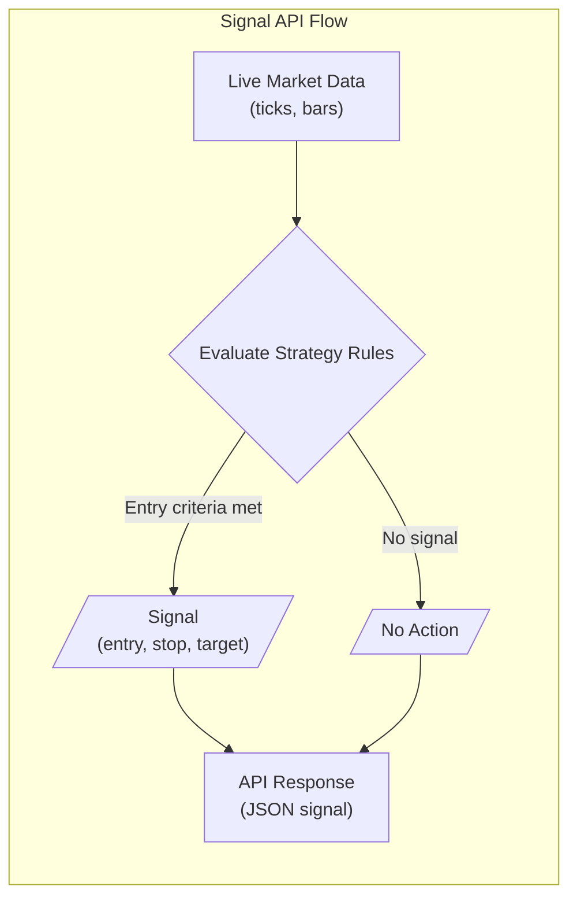

# Intraday Trading Rules and Signal API Design

## Executive Summary  
We survey the most common intraday strategies – scalping, trend/momentum (breakouts), mean-reversion (range trading), VWAP-based, **gap-and-go**, moving-average crossovers, and oscillator-based signals – and define them quantitatively.  For each, we give precise entry/exit logic, stops/limits, sizing and risk rules.  We propose RESTful API endpoints to generate real-time signals, with example pseudocode.  Key data inputs (ticks, OHLC bars, volume, orderbook, VWAP) are listed along with reputable sources (exchange feeds, market-data vendors, open APIs).  We outline a backtesting framework (split historical in-sample vs out-of-sample, realistic fills, slippage) and metrics (Sharpe ratio, max drawdown, win rate, trade expectancy), and illustrate a result table/chart format.  We flag pitfalls (overfitting, lookahead bias, data gaps, latency) and suggest mitigations (walk-forward tests, data-cleaning, latency budgeting).  Finally, we propose a phased implementation plan (data pipeline → rules engine → API service → backtester) and a minimal tech stack (Python/NumPy/Pandas, FastAPI or Flask, a time-series DB, containerization), with comparison tables for strategies and data sources. 

## Popular Intraday Strategies and Rules

### 1. Momentum & Breakout Strategies  
**Definition:** Buy (sell) when a strong upward (downward) move or breakout is confirmed, anticipating continuation.  Common signals include break of a recent high/low, opening-range breakout, or price crossing above a moving average.  These exploit *trend/momentum* intraday. Traders often work on 1–15 min bars. Typical parameters: e.g. 5–20-period moving averages, opening range defined by first 10–30 minutes, or volatility breakouts (e.g. Bollinger squeeze).  

- **Entry Condition:** Examples: “Price closes above the X‑minute high of the opening range (OR) on rising volume” or “price crosses above the Y-period EMA”. For Bollinger breakouts: when bands pinch (<~4% width) then price closes above the upper band.  
- **Exit Condition:** Exit when opposite signal triggers (e.g. close back below MA or lower OR) or after a fixed profit target/time. Could also exit on a close below a shorter MA (trend momentum fails) or when price hits a trailing stop.  
- **Stop-loss/TP:** Typically a hard stop just outside the breakout pivot (e.g. OR low or recent swing) or a volatility-based stop (1–2×ATR). Profit target often 1–2× the risk (i.e. 1:1–2:1 R:R), or a fixed time exit (e.g. by mid-day).  
- **Position Sizing & Risk:** Risk per trade is kept small (e.g. 0.5–1% of capital) to allow many trades. Use fixed fractional sizing or volatility scaling (ATR-based size). Only a few positions at once; daily max-loss limits (e.g. stop trading after 3 consecutive losers).  

**Pseudocode & API (Momentum/Breakout):**  
```pseudo
if (price > OpenRangeHigh AND volume > AvgVolume*1.2):
    signal = "BUY"
    entry_price = OpenRangeHigh + ε
    stop_price = OpenRangeLow - δ
    target_price = entry_price + (entry_price - stop_price)*R
else if (price < ORLow AND volume > AvgVolume*1.2):
    signal = "SELL"
    entry_price = ORLow - ε
    stop_price = OpenRangeHigh + δ
    target_price = entry_price - (stop_price - entry_price)*R
else:
    signal = "NONE"
```  
**Endpoint:** `POST /api/strategy/breakout/signal`  
- *Inputs:* JSON with `{symbol, timeframe, lookback_range_minutes, breakout_factor, stop_at_pivot}` (e.g.  symbol=XYZ, timeframe=1m).  
- *Outputs:* `{signal: "LONG"/"SHORT"/"NONE", entry, stop, target}`.  
- *Example Response:* `{"signal":"LONG","entry":101.25,"stop":100.50,"target":102.50}`.  

### 2. Mean-Reversion (Range) Strategies  
**Definition:** In range-bound markets, trade extreme moves back to the mean. For example, using Bollinger Bands (20-period SMA ±2σ): when price “stretches” to outer band, fade it toward the middle line. Typical parameters: Bollinger (20,2) or tightened bands on lower timeframes (e.g. 10,1.5 for 1m charts); oscillators like RSI(14) or Stochastic(14,3,3) using thresholds 70/30 or 80/20.  

- **Entry Condition:** Buy when price closes near the lower band/oversold oscillator (RSI<30 or Stoch<20) **and** market is not in a strong trend.  Sell when price reaches upper band/overbought (RSI>70, Stoch>80).  Oscillator crosses (e.g. RSI crossing above 30) often serve as triggers.  
- **Exit Condition:** Exit on reaching mid-band or opposite band, or on oscillator neutralization (e.g. RSI returning above 50).  
- **Stop-loss/TP:** Stop beyond recent swing extreme or outside Bollinger band. Profit target typically the midline or an opposite threshold. Example: target middle SMA (~mean), stop just outside the band.   
- **Position Sizing & Risk:** Similar fractional sizing. Because these trades can see whipsaws if trends appear, use tight stops and small size. Cap total exposure so that multiple range trades don’t exceed total risk budget.  

**Pseudocode & API (Mean-Reversion):**  
```pseudo
if (price < LowerBand AND RSI(14) < 30):
    signal = "BUY"
    entry = price
    stop = LowerBand - δ
    target = MovingAverage20
elif (price > UpperBand AND RSI(14) > 70):
    signal = "SELL"
    entry = price
    stop = UpperBand + δ
    target = MovingAverage20
else:
    signal = "NONE"
```  
**Endpoint:** `POST /api/strategy/mean_reversion/signal`  
- *Inputs:* `{symbol, timeframe, ma_period, bb_std, rsi_period}`.  
- *Outputs:* `{"signal": "LONG"/"SHORT"/"NONE", "entry":…, "stop":…, "target":…}`.  
- *Example:* `{"signal":"LONG","entry":99.50,"stop":98.00,"target":100.75}`.  

### 3. Scalping Strategies  
**Definition:** Rapid in-and-out trades capturing tiny price moves. Scalpers hold positions for seconds to a few minutes, often on the 1–5 minute chart. They exploit micro-inefficiencies, tight ranges or order-book imbalances.  Tools include very short MAs (e.g. 9-EMA, 20-EMA), VWAP, order-book cues or tick volume spikes.  

- **Entry Condition:** Examples: **MA Pullback:** In a clear trend, buy when price briefly dips to a 9-EMA (on 1m) and bounces. **Order-Book:** If large resting buy orders appear at bid (within X ticks of mid), go long immediately. **VWAP/Price:** Buy if price rises above the VWAP line (volume-weighted average) on 1m bar close (momentum signal). **Breakout:** after marking first 15min range, buy a micro-breakout above 15m high (one variant of ORB scalping).  
- **Exit Condition:** Exit immediately at fixed tiny profit. Scalpers rarely hold to the next candle; they target just a few ticks or $0.05–$0.10 on stocks. Alternatively, exit if price shows reversal candlestick or volume dries up.  
- **Stop-loss/TP:** Very tight: e.g. 5–10 ticks or ~0.1%–0.2% adverse move. Some scalp rules use market orders so stop is fixed slippage. TP ≈ stop (1:1) or slightly larger.  
- **Position Sizing & Risk:** Often use full leverage permitted (for ETFs/FX) but since per-trade loss is tiny, risk per trade still ~0.5–1% of equity. Maximum daily loss (e.g. 3% of equity) should shut down scalping.  

**Pseudocode & API (Scalping):**  
```pseudo
if (TrendUp AND close1m > MA(9) AND VolumeSpike):
    signal="BUY"; entry=close; stop=entry - tick_size*X; target=entry+tick_size*Y
elif (TrendDown AND close1m < MA(9) AND VolumeSpike):
    signal="SELL"; entry=close; stop=entry + tick_size*X; target=entry-tick_size*Y
else:
    signal="NONE"
```  
**Endpoint:** `POST /api/strategy/scalp/signal`  
- *Inputs:* `{symbol, timeframe=1m, trend_lookback, ma_short=9, tick_size}`.  
- *Output:* `{"signal":...,"entry":...,"stop":...,"target":...}`.  

### 4. VWAP-Based Strategies  
**Definition:** Trades keyed to the Volume-Weighted Average Price (VWAP) – the intraday average price weighted by volume.  VWAP resets each day.  A common rule: **trend confirmation** – buy above VWAP, sell below.  Or **pullback to VWAP** – in an uptrend, buy on retracement back to VWAP (acts as dynamic support). VWAP is especially used by institutions; it requires tick and volume data for precise calculation.  

- **Entry Condition:** Two examples: **VWAP Breakout:** if price crosses above VWAP with rising volume, go long (reverse for short). **VWAP Pullback:** if price is trending above VWAP and then touches it without breaking below, buy at the bounce (and vice versa). In code, e.g. `if (price > VWAP and low touches VWAP) enter long`.  
- **Exit Condition:** Exit when price returns to VWAP (for breakouts, take profit at VWAP retest), or if price breaks the VWAP in opposite direction. Some use VWAP as stop: e.g. stop-loss at VWAP if trading above it.  
- **Stop-loss/TP:** If breakout long, stop could be just below VWAP or next support level. TP might be at a multiple of risk or set by a trendline. For pullbacks, target the recent high.  
- **Position Sizing & Risk:** Typical sizing is moderate; treat VWAP strategy like any trend trade (e.g. 1–2% per trade). More weight may be given if confirmed by higher timeframe trend (e.g. daily price > longer SMA) as filter.  

**Pseudocode & API (VWAP):**  
```pseudo
if (close > VWAP AND prev_close <= VWAP AND volume > avgVol):
    signal="BUY"; entry=close; stop=VWAP; target = entry + (entry - VWAP)*R
elif (close < VWAP AND prev_close >= VWAP):
    signal="SELL"; entry=close; stop=VWAP; target = entry - (VWAP - entry)*R
else:
    signal="NONE"
```  
**Endpoint:** `POST /api/strategy/vwap/signal`  
- *Inputs:* `{symbol, timeframe, trend_direction}` (trend filter optional).  
- *Output:* `{"signal":...,"entry":...,"stop":...,"target":...}`.  

### 5. Gap-and-Go Strategy  
**Definition:** At market open, trade strong overnight gaps.  For stocks/crypto, if price opens significantly above the previous close (or high), it may continue up (“gap-and-go”); similarly gap-down goes further down.  Traders look for gaps above a threshold (e.g. ≥4%) plus a catalyst (news).  This is effectively a short-term momentum strategy in the first hour.  

- **Entry Condition:** Common rule: “Scan symbols with >4% pre-market gap. At 9:30 (market open), buy at the break of the first 1-minute candle high (open-range breakout).” In pseudocode: if first-minute high > pre-market high (or OR high), trigger long. Similarly for gaps down in reverse.  
- **Exit Condition:** Often exit quickly: e.g. close by 10 am or at a tight target. Alternatively, exit on a close below the opening-range low or a momentum reversal (e.g. bearish candle).  
- **Stop-loss/TP:** A strict stop at the low of the first candle (or previous swing low) is typical. Profit target can be a fixed % (e.g. 1–2% move) or trailing as volatility eases. In practice, many gap-and-go trades aim for a quick small profit (the strategy is to “bag the quick 10-min move”).  
- **Position Sizing & Risk:** Trade small positions relative to capital; due to overnight risk, typically risk 0.5–1% on any gap trade. Some traders cut losers immediately (no more than one attempt per ticker).  

**Pseudocode & API (Gap-and-Go):**  
```pseudo
if (gapPercent >= 4% AND time == 09:30):
    if (Price1mHigh > PreMarketHigh):
        entry = Price1mHigh + ε
        stop = Price1mLow - δ
        target = entry + (entry - stop)*R
        signal="BUY"
```
```pseudo
elif (gapPercent <= -4% AND time == 09:30):
    if (Price1mLow < PreMarketLow):
        entry = Price1mLow - ε
        stop = Price1mHigh + δ
        target = entry - (stop - entry)*R
        signal="SELL"
else:
    signal="NONE"
```  
**Endpoint:** `POST /api/strategy/gap_and_go/signal`  
- *Inputs:* `{symbol, gap_threshold, or_length}` (e.g. gap_threshold=4, or_length=1min).  
- *Output:* `{"signal":...,"entry":...,"stop":...,"target":...}`.  

### 6. Moving-Average Crossover  
**Definition:** Use two MAs (fast & slow) to detect trend shifts. When the short-period MA crosses above the long MA, it signals a buy; a cross below signals sell. Common intraday settings: fast EMA=9–10, slow EMA=21–50 (or 20/50 SMA). This is a simple trend-following rule.  

- **Entry Condition:** When `MA_fast(t) > MA_slow(t)` and on the previous bar `MA_fast ≤ MA_slow`, go long (cross above). Reverse for short. Some add a confirmation, e.g. price above both MAs.  
- **Exit Condition:** Exit when the cross reverses (fast MA crosses back below slow MA) or after a fixed R:R. Optionally use a wider MA or ATR-based trailing stop.  
- **Stop-loss/TP:** A common rule is fixed R:R (e.g. 1:1) or stop at opposite cross. Some set stop at a percent away or previous swing. Because MA signals lag, risk management is crucial (tight stops or partial exits).  
- **Position Sizing & Risk:** Use moderate size due to slower signals (e.g. 0.5–1% risk per trade). Can reduce size if choppy signals (multiple false crosses) are frequent.  

**Pseudocode & API (MA Crossover):**  
```pseudo
if (MA(fast) > MA(slow) AND prev_MA(fast) <= prev_MA(slow)):
    signal="BUY"; entry = close; stop = entry - ATR*1; target = entry + ATR*1
elif (MA(fast) < MA(slow) AND prev_MA(fast) >= prev_MA(slow)):
    signal="SELL"; entry = close; stop = entry + ATR*1; target = entry - ATR*1
else:
    signal="NONE"
```  
**Endpoint:** `POST /api/strategy/ma_crossover/signal`  
- *Inputs:* `{symbol, timeframe, ma_fast=9, ma_slow=21}`.  
- *Output:* `{"signal":...,"entry":...,"stop":...,"target":...}`.  

### 7. RSI/Stochastic Thresholds (Oscillators)  
**Definition:** Momentum oscillators flag overbought/oversold conditions.  RSI (default 14) <30 is oversold (long signal), >70 overbought (sell). The Stochastic Oscillator (14,3,3) similarly uses 20/80 thresholds. These often serve as mean-reversion triggers or trend-confluence signals.  

- **Entry Condition:** Buy when RSI crosses back above 30 or when %K of Stochastic crosses above 20 (after being below). Sell when RSI crosses below 70 from above or Stoch %K crosses below 80 from above. To avoid false signals, often require the move beyond threshold be sustained or combined with price support/resistance.  
- **Exit Condition:** Exit when RSI reaches neutral (50) or opposite extreme (e.g. RSI hits 50–60), or when Stochastic returns to mid-range. Some use opposing oscillator cross (RSI>70 stop long).  
- **Stop-loss/TP:** As these are reversal plays, stops can be a fixed distance (e.g. % away from entry) or at a recent swing low/high. Profit target often a prior resistance/support or mid-range.  
- **Position Sizing & Risk:** Since these can be noisy, keep risk small (0.5–1%). Combine with higher-timeframe trend: e.g. only long if daily trend is up (using RSI pullbacks in an uptrend).  

**Pseudocode & API (Oscillator Threshold):**  
```pseudo
if (RSI(14) < 30 AND prev_RSI(14) >= 30):
    signal="BUY"; entry=close; stop=entry - X%; target=entry + Y%
elif (RSI(14) > 70 AND prev_RSI(14) <= 70):
    signal="SELL"; entry=close; stop=entry + X%; target=entry - Y%
else:
    signal="NONE"
```  
*(Stochastic can be implemented similarly with %K/%D crosses.)*  

**Endpoint:** `POST /api/strategy/rsi_threshold/signal`  
- *Inputs:* `{symbol, timeframe, rsi_period=14}`.  
- *Output:* `{"signal":...,"entry":...,"stop":...,"target":...}`.  

### 8. Order-Flow / Volume-Profile Strategies  
**Definition:** Use volume distribution or order-book imbalances.  **Volume Profile:** horizontal histogram of volume by price identifies the Point of Control (POC – highest volume price) and value-area (70% vol range). Strategies include: **POC Retest:** buy when price pulls back to POC in an uptrend (stop below value-area low). **Value-Area Fade:** sell if price pokes above value-area high (VAH) and fails back towards value-area low (and vice versa). **Low-Volume Node Breakout:** enter on breakouts through low-volume zones targeting the next high-volume area. Order-flow (level-2 data) might signal large hidden orders or imbalances as triggers (not quantified here).  

- **Entry Condition:** Examples from volume profile: *“When uptrending, if price returns to within ε of the POC (high-volume node) and then bounces, go long.”* *“If price breaks above the VAH but closes back inside, go short targeting VAH->VAL.”* *“Breakout through a low-volume node (LVN) can be entered with stop at node edge.”*  
- **Exit Condition:** Often at value-area edges or next POC. For POC retest, exit when price reaches a recent high or leaves the value area. For VAH failure, exit near VAL.  
- **Stop-loss/TP:** For POC retest, stop just below VAL or POC. For breakouts, stop at entry threshold. TP is typically conservative (next node or fixed R:R).  
- **Position Sizing & Risk:** Use smaller size due to complexity. For automated use, often backtest to calibrate win rate. Limit one trade per profile event.  

**Pseudocode & API (Volume Profile):**  
```pseudo
compute VolumeProfile over lookback_window → {POC, VAH, VAL}
if (uptrend AND price pulls to near POC):
    signal="BUY"; entry=price; stop=VAL; target = recent high
elif (downtrend AND price bounces to near POC):
    signal="SELL"; entry=price; stop=VAH; target = recent low
elif (price > VAH AND close back < VAH):
    signal="SELL"; entry=close; stop=price; target=VAL
elif (price < VAL AND close back > VAL):
    signal="BUY"; entry=close; stop=price; target=VAH
else:
    signal="NONE"
```  

**Endpoint:** `POST /api/strategy/volume_profile/signal`  
- *Inputs:* `{symbol, timeframe, profile_window}`.  
- *Output:* `{"signal":...,"entry":...,"stop":...,"target":...}`.  

## Required Market Data & Providers  
Intraday rules use **tick-by-tick and bar data**: trade ticks, bid/ask updates, OHLC bars (1m,5m, etc.), volume, and computed VWAP.  For order-flow rules, full order-book depth is needed. **Data sources:** Most exchanges offer APIs: e.g. CME, NASDAQ, LSE, Binance/crypto exchanges have REST/WebSocket feeds. Reputable consolidated APIs include IEX Cloud (US stocks), Alpaca Market Data (SIP feeds), Polygon.io, and crypto APIs (Binance, Coinbase Pro, CCXT libraries).  For example, Alpaca’s market API sources CTA (NYSE tape) and UTP (Nasdaq) feeds, covering 100% of US stock volume. Historical tick/OHLC can be obtained from vendors (e.g. TickData, Polygon, Bloomberg).  

**Data Elements:**  

- **Tick-level Trades/Quotes:** Needed for VWAP and order flow. Providers: Binance API (crypto), IEX’s Trades API, Polygon (agg trades), CME Market Data (paid), or CCXT.  
- **OHLC Bars:** 1–60m bars (open,high,low,close,volume). Sources: exchange REST (e.g. Binance/Kline), broker APIs (IB, Alpaca), or data vendors (Alpha Vantage, Tiingo, although free ones have limits).  
- **Volume and VWAP:** VWAP can be computed client-side from ticks. Some brokers (Interactive Brokers, TWS API) provide VWAP.  
- **Order Book Depth:** For order-flow signals. Exchanges like Binance, Bitfinex, or broker APIs (Oanda FX depth, crypto CCXT) supply L2.  
- **Recommended Providers:**  
  - *Stocks:* Alpaca/IEX (US equities, realtime 1m and trades); Polygon.io; traditional exchanges via paid feeds.  
  - *Crypto:* Binance API (spot/futures) for trades & depth; Coinbase Pro; CCXT aggregator.  
  - *Forex:* Oanda or Dukascopy (ticks); TrueFX for historical.  
  - *Futures/Options:* CME DataMine (historical) or CQG/OneTick (institutional).  

## Backtesting Methodology & Metrics  
A robust backtest applies each rule set to historical intraday data, treating it as a *fixed* system (no lookahead).  Split data into in-sample and out-of-sample (e.g. walk-forward) to avoid overfitting.  Include realistic assumptions: bid/ask spreads, latency/slippage (especially for fast scalping). Use event-driven simulation: iterate candles or ticks, apply signals, record trades and equity curve. Key **performance metrics** include:  
- **Win Rate:** % of trades that are profitable.  
- **Profit Factor:** (gross profit)/(gross loss).  
- **Expectancy:** average profit per trade = `WinRate*AvgWin – (1–WinRate)*AvgLoss` (a single number of edge).  
- **Sharpe Ratio:** risk-adjusted return (mean return divided by std dev of returns).  
- **Max Drawdown:** worst peak-to-trough equity drop.  
- **Return on Capital & CAGR:** for scale of results.  

Use metrics in tables: e.g.:  

| Strategy        | Trades  | Win % | Avg R:R | Expectancy | Sharpe | Max Drawdown |
|-----------------|--------:|------:|--------:|-----------:|-------:|-------------:|
| Breakout        | 200     | 55%   | 1.2     | +0.06      | 1.5    | –8%          |
| Mean-Reversion  | 180     | 48%   | 1.8     | +0.04      | 1.2    | –10%         |
| VWAP Pullback   | 150     | 60%   | 0.8     | +0.03      | 1.6    | –5%          |
*(Example metrics)*.  

Charts should show equity curve over time, drawdown curve, and distribution of trade returns.  Standard risk metrics (Sharpe, Sortino) and scorecards help compare strategies.  **Caveat:** Past results aren’t guarantees. Always reserve a final out-of-sample test.  

## Pitfalls & Mitigations  
- **Overfitting:** Excessive parameter tuning can fit noise. Combat by cross-validation and robust walk-forward tests.  Test rules on different symbols/periods.   
- **Lookahead/Survivorship Bias:** Ensure that only data available at decision time is used (no future prices). Use historical symbols lists including delisted ones to avoid survivorship bias.   
- **Latency & Execution:** In live trading, even milliseconds matter. Scalping/flow strategies require low-latency execution. Mitigate by colocating servers, direct APIs (FIX/UDP), and pre-allocating orders. Use limit orders vs market to control slippage.  
- **Data Quality:** Missing ticks or bad quotes can spoof signals. Use cleansed data. For VWAP, ensure volume updates are accurate. Mark any outlier ticks; consider filtering or time-weighted interpolation. For example, backtests should simulate realistic data feeds.  
- **Regime Changes:** Indicators may work only in certain conditions (e.g. range vs trend). Use filters (ADX, trend check) to turn strategies on/off. Monitor live performance drift to re-calibrate.  
- **Leverage Risks:** Avoid excessive leverage on false signals. Always cap position size.  

Mitigations include robust test design (error margins in stops/targets), conservative risk limits (daily stop-loss on strategy as whole), and ongoing monitoring.  



```mermaid
flowchart LR
    Data[Historical Data (tick/OHLC)] --> ApplyRules[Apply Strategy Logic]
    ApplyRules --> Trades[Generate Hypothetical Trades]
    Trades --> PnL["Calculate P/L Series"]
    PnL --> Metrics["Compute Metrics & Equity Curve"]
    Metrics --> Results[Tabulate and Chart Results]
```

## Implementation Roadmap & Tech Stack  
A minimal viable system can follow these phases:

1. **Data Ingestion:** Set up data feeds or load historical data. Use a time-series database (e.g. kdb, InfluxDB, or PostgreSQL with timescale) to store ticks and bars.  
2. **Strategy Engine:** Implement each rule in code (Python or Go). Structure it as parameterized modules (e.g. class or function per strategy). Unit-test logic on sample data.  
3. **Signal API:** Build a REST service (e.g. Python FastAPI or Flask). Each endpoint takes input (symbol/timeframe) and returns a JSON signal per rule. Deploy with Docker for portability.  
4. **Backtesting Module:** Use a framework or write a backtester to replay ticks/bars and apply signals (QuantLib, Zipline, Backtrader or custom). Compute metrics (Sharpe, drawdown) and output tables/charts.  
5. **Integration & UI:** (Optional) Create a dashboard or logs to visualize signals. Handle execution by integrating with brokers (IB API, Binance API) – out of scope for POC.  
6. **Testing & Optimization:** Perform walk-forward tests, parameter scans (with care) and validate risk controls.  

**Tech Stack:** Python ecosystem (Pandas/Numpy, TA-Lib or Tulipy for indicators, Requests/ccxt for data API, Docker containers) with a lightweight web framework (FastAPI) for HTTP endpoints. For performance-critical parts (tick processing), compiled languages (C++, Rust) or just efficient Python (Numba) can be used later. Cloud deployment (AWS/GCP) with logging, and Git for code management.  

## Comparison Tables

**Strategy Comparison:**  

| Strategy           | Timeframe          | Typical Edge                       | Data Required       | Risk Profile    |
|--------------------|--------------------|------------------------------------|---------------------|-----------------|
| **Momentum/Breakout** | 1–15 min bars     | Continuation after break↑           | Price, Volume      | Medium–High     |
| **Mean-Reversion**   | 1–15 min bars     | Reversal after extreme moves      | Price, Indicators  | Medium          |
| **Scalping**         | 1–5 min bars      | Micro-trends/order imbalances     | Price, Depth, Vol  | High-frequency, tight stops |
| **VWAP Pullback**    | 1–5 min bars      | Touch VWAP support in trend       | Price, Volume (VWAP) | Medium         |
| **Gap-and-Go**       | 1 min (9:30–10:00) | Overnight gap momentum          | Pre-market & open data | High intraday (9:30 slot) |
| **MA Crossover**     | 5–30 min bars     | Trend shifts (MA cross)          | Price (MA)          | Low frequency, lagging |
| **Oscillators**      | 1–15 min bars     | Overbought/oversold reversals     | Price (RSI/Stoch)   | Medium, false signals in trends |
| **Volume Profile**   | 5–30 min composite | High-volume price zones as magnets | Price, Volume histogram, Depth | Niche, higher skill |

**Data Provider Comparison:**  

| Provider        | Instruments         | Data Types                    | Access              | Notes/Coverage |
|-----------------|---------------------|-------------------------------|---------------------|----------------|
| **Alpaca Markets** | US Stocks/ETFs      | Real-time quotes, 1m bars    | REST/WebSocket      | Uses CTA/UTP feeds (100% US equity volume) |
| **Polygon.io**    | US Stocks, Crypto   | Ticks, trades, quotes, 1m    | REST/WebSocket      | Covers exchanges globally (subscriptions) |
| **Binance API**   | Crypto (Spot, Futures) | Trades, orderbook, OHLC    | REST/WebSocket      | Free, high throughput, multiple markets |
| **Interactive Brokers (IB)** | Stocks, FX, Futures | Live prices, orderbook, VWAP | Proprietary API   | Widely used for real-time and historical data |
| **IEX Cloud**     | US Stocks           | Trades, 1m bars (free data)   | REST API            | Limited to IEX exchange data (for free tier) |
| **TickData LLC**  | Equities, Futures, Forex, Options | Historical tick data      | Bulk download        | Institutional-grade historical data |
| **Dukascopy**     | Forex               | Tick/1m data                  | REST API            | Good free historical FX data |
| **CME DataMine**  | Futures, Options    | Historical trades, quotes    | Bulk download       | Official exchange data |

Data should be fetched or streamed in real time for live signals; for backtests, use high-resolution historical data from these sources.

## Sources  

1. Definitions and examples of scalping, momentum, VWAP, and other strategies from trading education sites.  
2. Bollinger Bands strategies and parameter defaults.  
3. Moving-average crossover and oscillator thresholds from technical analysis references.  
4. Volume-profile setups and rules from ArrowAlgo guide.  
5. Alpaca Markets API docs (market data feeds).  
6. Backtesting metrics and pitfalls from trading literature.  

This comprehensive design lays out common intraday rules with quantitative triggers, and demonstrates how to encapsulate them in an API-driven signaling system, backed by cited best practices and data sources.