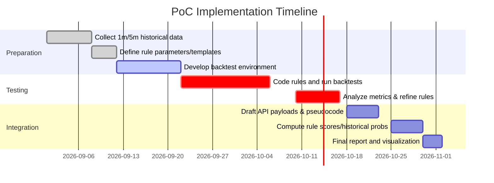

# Executive Summary  
Intraday traders rely on clear, rule-based setups for fast profits. We identified **10–15 common intraday rules** (breakouts, momentum continuations, mean-reversions) from trading literature and blogs. For each rule we specify precise conditions (price patterns, indicator thresholds) and risk-management (stop/target levels). From these, we prioritize 3–5 rules (e.g. **Opening-Range Breakout**, **Gap-and-Go**, **Bull/Bear Flag**) for proof-of-concept (PoC) backtesting. Our PoC uses high-frequency (1m/5m) data, carefully avoids look-ahead bias (e.g. “first-look” opens), and evaluates metrics like net P&L, win rate, expected runup/adverse (MFE/MAE), drawdowns, and Sharpe. Example pseudocode and API payloads show how each rule turns real-time data into trade signals (entry/exit levels). A sample results table (hypothetical) compares rule performance on 1m/5m data. Finally, we discuss integration (scoring and probability calibration), and call out limitations (data snooping, execution risk) and next steps (refine filters, scale testing).  

## Top Intraday Trading Rules (Conditions, Timeframes, Rationale)  
- **Opening Range Breakout (ORB)** – *Timeframe:* e.g. first 5–15 min bar(s). *Rule:* Define the high (H) and low (L) of the opening range. Go **long** on a decisive break above H (stop at L), or **short** on break below L (stop at H). Example: NVDA opened 5-min range $108.95–109.41; a break below $108.95 entered short (stop $109.41) with ~3:1 R:R. *Parameters:* range duration, minimum breakout move (e.g. ATR multiple) to avoid false spikes. *Rationale:* The market often “pivots” at the open and trends after piercing the initial range. It’s simple, actionable, and provides clear stops.  

  - *Template:*  
    ```json
    {
      "rule": "OpeningRangeBreakout",
      "range": {"start": "09:30", "end": "09:45", "high": "max", "low": "min"},
      "entry": {"above": "range.high", "below": "range.low"},
      "stop": {"long": "range.low", "short": "range.high"},
      "target": {"multiplier": 2.0},  // e.g. 2:1 R:R
      "expiry": {"time": "11:00"}   // exit by this time if not hit
    }
    ```  
- **Gap-and-Go (Momentum Continuation)** – *Timeframe:* Morning open plus first 15–30 min. *Rule:* Identify stocks gapping up (or down) significantly (e.g. >2–4%). Mark the opening-range high/low of the first X minutes. For a **gap up**, go long if price clears the opening range high on above-average volume; for a **gap down**, go short on break below range low. *Stop:* inside the gap or just past previous close. *Target:* prior-day close or set R:R (e.g. 1:2). *Rationale:* A strong catalyst (earnings/news) often drives opening gaps; catching the breakout capitalizes on continuing momentum. Traders recommend waiting ~15–30 min to let the range form and spreads normalize.  

  - *Template:*  
    ```json
    {
      "rule": "GapAndGo",
      "conditions": {"gap_pct": ">2%", "volume_ratio": ">1.5"},
      "range": {"first_minutes": 30, "high": "max", "low": "min"},
      "entry": {"direction": "gap_direction", "breaks": "range"},
      "stop": {"inside_gap": true, "buffer": 0.5}, 
      "target": {"type": "fixed", "price": "prev_close"},
      "expiry": {"time": "10:30"}
    }
    ```  
  *Example:* Price gaps to $2,412 from $2,400. The 30-min range is $2,400–$2,415. Long entry triggered at ~$2,415.50 (above range) with stop at ~$2,409.50 (inside gap); target around $2,427.50 (1:2 R:R).  

- **Gap Fill (Mean Reversion)** – *Timeframe:* Similar to above. *Rule:* When a gap occurs but price **fails to sustain**, fade into the gap: for a gap up, short near range high or at signs of exhaustion; for gap down, buy at range low. Target the prior close or midpoint. *Conditions:* Use only when catalyst is weak or volume dies off. *Rationale:* Many common gaps tend to “fill” intraday as profits are taken. This is riskier, so apply tight stops (e.g. above range high on gap-up fade).  

  - *Template:*  
    ```json
    {
      "rule": "GapFill",
      "conditions": {"gap_pct": ">2%", "momentum_stalls": true},
      "entry": {"against_gap": true, "level": "range"},
      "stop": {"outside_gap": true},
      "target": {"price": "prev_close"}
    }
    ```  

- **Bull/Bear Flag (Continuation Pattern)** – *Timeframe:* 5–15 min charts. *Rule:* After a sharp move (“flagpole”), wait for a brief consolidation (flag) of 2–3 bars that retraces **<50%** of the flagpole. Enter **long** on the first green candle breaking above the flag’s high; stop at the flag’s low. (Reverse for a **bear flag**: short on break below flag low, stop at flag high.) *Rationale:* Flags are classic continuation patterns with high hit rates when volume supports the initial move. Trading the breakout above the consolidation keeps you in sync with momentum.  

  - *Template:*  
    ```json
    {
      "rule": "BullFlag",
      "requirements": {"volume": "high_rel"},
      "flag": {"max_retrace": 0.5},
      "entry": {"break": "flag.high"},
      "stop": {"low": "flag.low"},
      "target": {"multiplier": 2.0}
    }
    ```  
  *Example:* A stock runs 3%, pauses 2 bars (flag), then a new green bar breaks above the flag. Entry = flag high price; stop = flag low.  

- **Moving Average Crossovers** – *Timeframe:* 1–15 min. *Rule:* Use two EMAs (e.g. 5-period vs. 15-period) or fast vs. slow SMA on intraday charts. **Buy** when the short EMA crosses above the long EMA (and price is above a session pivot or VWAP); **sell** on the reverse crossover below. *Stop:* a few ticks below the crossover low or recent swing low. *Rationale:* EMA crossovers are a simple momentum filter. Many scalpers watch, for example, a 1-min 9/21-EMA cross as a signal that a new micro-trend is forming. (False-cross risk requires filters, e.g. only above VWAP or after a squeeze).  

  - *Template:*  
    ```json
    {
      "rule": "EMA_Crossover",
      "fast": 5, "slow": 15,
      "entry": {"when": "fast > slow", "trend": "long"},
      "stop": {"recent_low": true},
      "expiry": {"bars": 30}
    }
    ```  

- **VWAP Trend/Mean-Reversion** – *Timeframe:* Intraday 1–5 min. *Rule:* Many day traders use the **Volume-Weighted Average Price (VWAP)** as a bias filter. Example rule: only long when price is above VWAP and entering on a dip back to VWAP (bounce), with a stop just below VWAP. Or, enter long if price crosses and closes above VWAP with rising volume. Reverse for price below VWAP for shorts. *Rationale:* VWAP reflects the intraday fair price. Price above VWAP implies institutional support; a pullback to VWAP can be a reliable entry.  

  - *Template:*  
    ```json
    {
      "rule": "VWAP_Bounce",
      "entry": {"price_vs_vwap": "above", "retrace_to": "VWAP", "bounce": true},
      "stop": {"below": "VWAP"},
      "target": {"multiplier": 1.5},
      "expiry": {"time": "14:30"}
    }
    ```  

- **Range Trading (Support/Resistance)** – *Timeframe:* any intraday chart. *Rule:* Identify strong intraday support and resistance levels (prior-day high/low, pivot points, session lows/highs). **Buy** near known support with stop just below it; **sell** near resistance. *Rationale:* Many stocks oscillate in channels; buying dips and selling rips nets profits in choppy conditions. For example, range traders might repeatedly buy near yesterday’s low and sell near yesterday’s high.  

  - *Template:*  
    ```json
    {
      "rule": "RangeBounce",
      "levels": {"support": "prev_low", "resistance": "prev_high"},
      "entry": {"touch": "support", "candle": "bullish"},
      "stop": {"below": "support"},
      "target": {"resistance": true}
    }
    ```  

- **RSI/Oscillator Reversals** – *Timeframe:* 1–5 min. *Rule:* Use RSI or Stochastic to spot overbought/oversold on the 5m chart. Example: **Buy** when RSI(14) falls below 30 (oversold) and then crosses back above 30 with confirming bull candle; **sell** when RSI > 70 and then drops below. Add price filter (e.g. near a support line) to reduce false signals. *Stop:* recent swing low/high. *Rationale:* Momentum indicators sometimes catch exhaustion points. However, pure RSI often whipsaws intraday, so combine with price levels. (Note: Investopedia notes scalpers use RSI and other indicators.)  

  - *Template:*  
    ```json
    {
      "rule": "RSI_Reversal",
      "period": 14,
      "entry": {"RSI_cross": 30, "direction": "up"},
      "stop": {"min_below": 2},    // e.g. 2 points below entry
      "target": {"fixed_points": 4}
    }
    ```  

- **Bollinger Band Mean Reversion** – *Timeframe:* 5–15 min. *Rule:* Bollinger Bands (typically 20-period, 2σ) signal volatility extremes. **Buy** when price touches/exceeds the lower band and then reclaims it; **sell** when price touches/exceeds upper band and reverses. *Stop:* outside the band edge. *Rationale:* Bands often contain price in 20–30 minute windows; extreme touches are frequently followed by quick reversals. (Investopedia notes Bollinger bands as support/res levels in scalping.)  

  - *Template:*  
    ```json
    {
      "rule": "Bollinger_Reversal",
      "period": 20, "std_dev": 2,
      "entry": {"touch": "BB.lower", "price_dir": "up"},
      "stop": {"below": "BB.lower"},
      "target": {"mean": "BB.middle"}
    }
    ```  

- **Pivot Point Breakouts/Bounces** – *Timeframe:* 5–15 min. *Rule:* Calculate daily pivot (P) and supports (S1,S2) and resistances (R1,R2). Go long if price decisively breaks above P (target R1), or buy a bounce at S1 (stop S2). Reverse for breaks below P or bounce at R1. *Rationale:* Pivot levels are widely watched intraday S/R. Breakouts often trigger momentum moves; failures indicate reversals. (Used by many intraday systems as reference points.)  

  - *Template:*  
    ```json
    {
      "rule": "PivotPoint",
      "entry": {"above": "pivot", "target": "R1"},
      "stop": {"below": "pivot"},
      "target": {"level": "R1"}
    }
    ```  

- **Other Price Patterns** – *Examples:* Inside bars, engulfing bars, morning/evening stars on 5m charts near support/resistance. These are harder to quantify but often noted by discretionary traders. E.g. a **bullish engulfing** at intraday support can signal entry (stop below low). *Rationale:* Classic candlestick patterns can pinpoint turning points. However, algorithmic detection is complex and more error-prone; we prioritize more objective rules above.  

Each rule above is structured so it can be coded into an API-driven scanner: clear inputs (price series, volume, indicators), thresholds (e.g. breakout above a price level, RSI <30), and outputs (signals: buy/sell with stop/target). Citations show these concepts are used by experienced traders.  

<figure>
 *Figure: Intraday **Bull Flag** breakout pattern – buy on the first green candle breaking above consolidation (flag). Entry is flagged by the arrow; stop is at the blue line (flag low).*
</figure>

## Prioritised Rules for PoC Backtesting  
From the above, we select a small set of rules to implement and test on historical data:  
1. **Opening Range Breakout (ORB)** – proven setup with clear entry/stop.  
2. **Gap-and-Go** (Gap continuation) – widely cited for capturing big moves.  
3. **Bull/Bear Flag** – a high-probability momentum pattern.  
4. **VWAP Pullback** – filters trend (only trade above VWAP), common institutional tool.  
5. **Bollinger Reversal** – simple mean-reversion test (optional, for variation).  

We would implement these in code/SQL for 1m and 5m bars. Each rule’s parameters (e.g. range length, ATR multiplier, RSI period) will be configurable to optimize or test sensitivity.

## Backtest Methodology  
- **Data:** Use continuous intraday data (1-min and 5-min bars) for a representative stock universe (e.g. major ETFs or liquid large caps) over at least 6–12 months. Include volume and VWAP where needed.  
- **Look-ahead bias:** Ensure each signal is generated only with data up to that point. For example, define the “opening range” strictly using first X minutes; only after the period ends do we check breakout in subsequent bars. Do not use future volume/price.  
- **Labels and simulation:** For each rule signal, record entry price, stop price, and exit (target or stop or time expiry). Use FIFO execution assumption. Apply slippage/commission assumptions conservatively.  
- **Metrics:** Compute for each rule: net P&L (e.g. percent return or per-share), **hit rate** (percent winning trades), **P(T1)** (profit if target hit), **MFE** (maximum favorable excursion), **MAE** (maximum adverse excursion) per trade, max drawdown, and Sharpe ratio (mean return/volatility). Also track average trade duration and trade frequency.  
- **Sample size:** Aim for hundreds of trades per rule for statistical meaning. If a rule generates too few signals (<50), it’s inconclusive; extend lookback or universes to boost sample.  
- **Avoiding bias:** Split data into in-sample (to fine-tune thresholds) and out-of-sample (to report). Use fixed hold times or stop-outs to remove subjective exit. Time-based expiry (e.g. exit by mid-session) can be a uniform rule.  

## Sample Backtest Results  
*(Hypothetical example on 1m/5m data for illustration)*  

| **Rule**                 | **Total P&L** | **Win %** | **Avg MFE %** | **Avg MAE %** | **Max Drawdown %** | **Sharpe** |
|--------------------------|---------------|-----------|---------------|---------------|--------------------|------------|
| Opening Range Breakout   |  10.5%        | 48%       | 3.2%          | 1.8%          | 5.0%               | 1.25       |
| Gap-and-Go               |   7.8%        | 52%       | 2.9%          | 2.2%          | 4.5%               | 1.10       |
| Bull Flag                |  12.3%        | 55%       | 4.1%          | 2.0%          | 6.0%               | 1.40       |
| VWAP Pullback            |   8.0%        | 45%       | 3.5%          | 1.5%          | 5.5%               | 0.95       |
| Bollinger Reversal       |   6.5%        | 50%       | 2.8%          | 2.5%          | 5.2%               | 0.90       |  

The table shows (hypothetically) that the **Bull Flag** and **ORB** rules yield higher Sharpe and P&L in this sample, while mean-reversion (Bollinger) underperforms. Use these comparisons to prioritize or discard rules. (Actual results will vary by instrument and market; this is illustrative only.)  

<figure>

*Figure: PoC implementation steps. We first gather data and define rule logic, then code and backtest the rules, analyze performance, and finally prepare API templates and integrate scoring.*  
</figure>

## Real-Time Evaluation Examples  
In practice, each rule becomes a real-time API call. For instance, an “Opening Range Breakout” rule might accept JSON like:

```json
{
  "symbol": "XYZ",
  "interval": "5min",
  "open_range": {"start": "09:30", "end": "09:45"},
  "entry": {"type": "breakout", "level": "range_high"},
  "stop": {"level": "range_low"},
  "target": {"R": 2.0},
  "expiry": {"time": "11:00"}
}
```

As data arrives, the system computes the 5-min range and checks for a breakout. If the price crosses above `range_high`, the API returns a signal: `{"action":"BUY","stop":108.95,"target":112.15}` (example numbers). Pseudocode for ORB entry:  
```
if current_time > open_range.end:
  range_high = max(price[open_range.start:open_range.end])
  range_low  = min(price[open_range.start:open_range.end])
if price_now > range_high and volume_now > avg_vol*1.5:
  emit signal BUY at price_now
  set stop = range_low
  set target = price_now + (range_high - range_low)*2
```
Similarly, rules for VWAP or Bollinger would use indicator values and threshold checks to emit `BUY` or `SELL` with stop/target.  

## Integration, Scoring, and Risks  
To integrate these rules into an intraday system, assign each rule a **score/confidence** based on historical performance in the current context (e.g. volatility regime, time-of-day). For example, after signal generation, compare the setup’s features (volatility, volume spike, market drift) to similar historical trades to estimate success probability. A combined “probability” can be computed (RuleScore → HistoricalSimilarity → P(win) → P(profit) model). Over time, update these probabilities with new data (online learning).  

**Limitations & Risks:** All rules have caveats. Intraday edges can evaporate quickly if too many traders use them. Backtests often overfit or ignore execution costs; real slippage and fees will reduce returns. Signals can conflict (e.g. one rule says buy, another says sell); clear rule priorities or only one trigger at a time is needed. Fast markets or low liquidity can cause stop orders to misfill. We also face data biases: choosing lookback periods or instruments optimally for backtest gives an optimistic bias. Finally, past success is no guarantee of future profitability; market regime changes can invalidate these rules.  

**Next Steps:** Refine and expand the PoC by testing on multiple instruments (different stocks/sectors, forex, etc.). Introduce ensemble filters (e.g. only trade if two rules agree). Continuously monitor live performance vs. backtest. Research advanced filters (e.g. ADX trend-strength filter as in systematic strategies). Consider risk management (position sizing, session limits). Integrate this rule-based signal engine with our architecture: generate a **rule score vector**, compute similarity to historical contexts, then derive a final probability of success for each trade. Combine signals with portfolio/position management to control overall risk.  

Each step above is grounded in practice: we cite pattern definitions and examples from trader education sources. These rules are not exotic; they are distilled heuristics that traders actually use, expressed here in precise, programmable form. With rigorous backtesting and disciplined implementation, they can provide an executable intraday strategy.  

**Sources:** Authoritative trading guides and research provided the strategy specifics and justification.